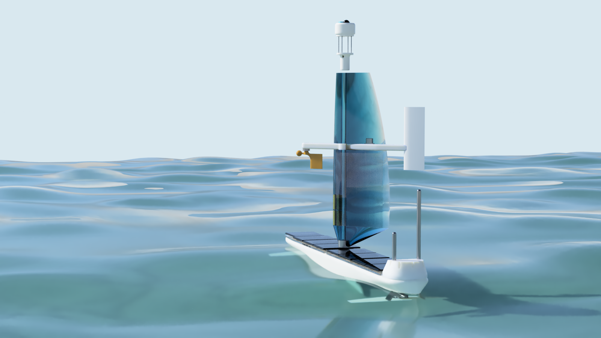

# DeepPlankter

An autonomous wave and wind propelled drone boat.

It use free energy in the surrunding environment to sail for a very long distance. It relies on in-air free-rotate wing and the underwater wings to provide propulsion and solar panels to power the onboard electronics.   

This repo hosts the main design files (PCB, mechanical parts and development logs) of the DeepPlankter project, excluding the boat controller firmware and communication method. 

- The source code of **navigation controller firmware** will be hosted in its own [repo (Not yet public)]() 

- **Communication protocols and the remote control App/Website** are **NOT** opensourced because of safety reasons.

# Hardware

PCB file can be found in [PCB](PCB) folder. 

**The boat controller:**

- Dimension: 80 x 100 mm
- MCU: STM32H7A3ZI, 280MHz, 1MB SRAM, 2MB Flash. 
- NorFlash
- RTC

**Sensors:**

- IMU: BMI088
- e-compass: HMC5883L
- Environment sensor: BME280 (humidity, atmospheric pressure, temperature)

**Power supplies:**

- DC/DC LMR33640, 5.1V, 4A (max) x 3 controlled channels.
- DC/DC LMR33640, 3.3V, 4A (max) x 2 controlled channels.
- 2 battery connectors 
- 2 charging connectors. 

**Power connector functions and monitoring**

| Connector          | Ctrl. Switched | Voltage gauge | Current gauge | Comments                        |
| ------------------ | -------------- | ------------- | ------------- | ------------------------------- |
| 3.3V (CH1, CH2)    | yes            |               |               |                                 |
| 5V (CH1, CH2, CH3) | yes            |               |               |                                 |
| BAT (CH1, CH2)     | *yes           | yes           | yes           | Base on ideal diode controller. |
| Charge (CH1, CH2)  |                | *note         | yes           | Voltage = BAT                   |
| ESC power          | yes            | *note         | yes           | Voltage = BAT                   |
| Servo (CH1, CH2)   | yes            | *note         | yes           | Voltage = BAT                   |
| Servo (CH3)        |                | *note         |               | Voltage = BAT                   |

**Extension IOs:**

- 2 x 2P NTC (for each battery)
- 1 x 2P ADC
- 1 x 2P External LED (Flash light)
- 1 x 2P External Buzzer
- 3 x 6P UART (marked TELE1, TELE2, main GPS)
- 2 x 4P UART
- 2 x 8P SPI (MISO, MOSI, SCK, CS1, CS2, IO)
- 2 x 4P I2C (same PHY)
- 1 x 4P FDCAN
- 1 x USBD
- 1 x 24P FPC DCMI camera interface (for OV2640)
- 1 x 8P FPC and 2x4 rows debugging port (SWD + UART)
- 1 x SDCard slot (SDIO)

## Battery, solar panels and MPPT chargers

- Battery 1: 18650 1500mAh 2S 9P
- Battery 2: 18650 1500mAh 2S 9P
- Panel set 1: 12V 160mA 4P 
- Panel set 2: 12V 160mA 4P 
- MPPT charger: BQ24650 model x 2
- 2S over current protector and balance x 2
- NTC x 2

The power of the whole boat is purely supplied by solar panels. 
We need to ensure the main controller never run out of power. 
The power distribution is managed by the main controller board. 
8 panels are grouped into 2 set with 4 panels in each set. 
Each set of panels charge one battery through a independent MPPT charger and balanced by an independent protect board. 
The power from the 2 batteries finally merge to a power rail through 2 ideal diode circuit. 
Then the power can be distribute by the main controller board. 

The voltage and current of each charging circuit and battery are monitored.

### Energy estimation

Each panel is rated 12V@160mA. In a sunny April day noon time, the maximum current measured is 10.5V@120mA when laying flat (simulate the angle on the boat). 

So the peak power is around 1.25W for each panel. 8 of them can generate 10W. 

But there are efficiency drop due to DC/DC converter and the battery charging efficiency. We assume it is around 0.8, so the peak power to charge the battery is 8W. 

The peak power multiple by the term, "peak sun hours", is the energy that generated per day.  
For example,  per [this blog](https://www.pveducation.org/pvcdrom/properties-of-sunlight/average-solar-radiation#), in UK summer time, the peak sum hour is 5 hours, while in the winter, the number drops to 0.5 hours, so the power generated per day is around 40wh to 4wh. 

> The average daily solar insolation in units of kWh/m2 per day  is sometimes referred to as "peak sun hours". The term "peak sun hours"  refers to the solar insolation which a particular location would receive if the sun were shining at its maximum value for a certain number of  hours. 

Sailing during the winter is definitely a nightmare for the boat no matter how big the battery is, it will be drained out very soon if we don't cut off the power to every module or put them into sleep. 

We have 2 battery sets, each can store around 100Wh. It needs 5 sunny days to fully charge. 

Both batteries together can supply a 1W consumption (3.3V 300mA) for a good week until next sunny days. Or 0.2W (3.3V 60mA)for a month. 

# Contact

Jianjia Ma 
`majianjia(-at-)live.com`
