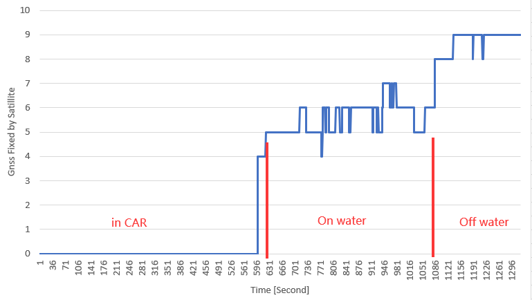

# First experiment at Setley Pond

Did a experiment at Setley Pond, New Forest this Sunday afternoon 7th March 2022. 

In this experiment, I would test a few different things. Including

- manual control and motor drive.
- underwater wings. (cancelled, due to no wave)
- waypoint mission. (cancelled, due to low rudder effectiveness)

As you expected, this experiment wasn't goes well. Fortunately, the boat float and recovered. Also, [data](../experiments/2022-03-06 dp first water run) are recorded so we have something to analysis.

The motor can really push the quite fast, even the throttle has been limited to 50%. The motor consume around 5 Amp current at 50% throttle. When I pushed the throttle fully from the App (50%), I am quite worry about the boat sinking into the water and become a submarine... Beside the boat was not being able to turn, it is really fun to play with.

Trying to plot the GNSS location in a map, but due to the EMC problem that discuss below, the GNSS can only be located by 4-5 satellites during the trial, the accuracy is pretty low, the path is meaningless. 

In the next sessions, I will show the issues that found during the experiment and some of the solutions. 

## Issues

- [EMC problem with antennas](#emc-issue). 

- [Water leaking from unknow source](#water-leaking-issue).

- [Dead servo might due to over voltage](#servo-found-dead).

- [Low rudder effectiveness](#low-rudder-effectiveness). 

- [ESC response too slow](#esc-response-too-slow). 

- [Batteries magnet field affecting magnetometer](#batteries-magnet-field-affecting-magnetometer). 

- [Boat mass centre too high, unstable](#boat-mass-centre-too-high). 

- [Camera data error and image over exposure](#camera-data-error-and-image-over-exposure). 

### EMC issue

At the experiment, all antennas are placed in the bridge at the tail of the boat. 

SIM800C's antenna is placed closed to LoRa's antenna, even in  the same direction. What makes things even worst is they are working at a similar frequency band 800/900M for GSM and 868M for LoRa.  It was ok during home test because the city area has better cellular coverage so the GSM module won't emit too much power. But in the rural, it starts to emit more power so the LoRa is now struggling to send/receive data. 

GPS module also suffered from the GSM module's RF. From the data it recorded, I can see there is only 5 satellites connections when the boat was on the surface of the water, where the signal is weaker. But when I recovered the boat and raised the boat to my car's boot, then it can see 10+ satellites.

The potential solution is to move the GSM module and its antenna to the bow of the boat. 

For the Iridium, I think it will be ok to stay at the tail bridge because it won't be activated too much. 

The GSM module cannot be placed at the mat because the QingStation uses BME280 for pressure and humidity measurement, which is RF sensitive. 

### Water leaking issue

There was a half cup of water found after I returned home. It is fortunate that I remove the battery from the controller board before I set off. I had to dry out the batteries because they are wet. 

I think it might come from some screw holes that I did not put a screw in. Hopefully, I can fix that later. 

### Servo found dead

One of the servo, servo 1, left rudder, was found dead just before deploying the boat. I supply direct battery voltage to the servo, which is 8V currently, the Servo's working voltage was rated at 4.8 to 7.2V. Looks like it burned out the servo. I disassembled the dead servo but couldn't find a burning spot on the controlling PCB. The reason of the failure remains unclear. 

I order a few mini-360 step-down DC/DC boards to lower the voltage and a new servo to replace the dead one. I would set the voltage to 5.5V. The recorded peak working current for these servos is less than 1A. I believe the small DCDC board can handle the servo's current.

### Low rudder effectiveness

This issue is partially related to the dead servo, but also the length of the rudder is underestimated. I did try to build an extended rudder that can stick on the existing rudder which I brought long time ago designed for RC boat. 

With only one working rudder, the boat can barely turn at high speed. I think that is because the motor was placed far behind the rudder.  The blue highlighted part is the new extension that will be added to the rudder. 

### ESC response too slow

I added a smooth throttle response in the software to eliminate the immediate change direction of the motor. But the value is too large. Adding some signalling delay, the boat feels like out of control many times, did not response for 5 seconds, while I did hear the servo is still responding to my command. Easy fixed issue. 

### Batteries magnet field affecting magnetometer

Fixed by moving the battery forward.. 10 cm away of controller box.

### Boat mass centre too high

Due to the heavy solar panels, the decks and the screws to fixed the decks, the mass centre were lifted too high, resulting in unstable roll motions. Even the propeller rotation cause 20 degrees rolling. 

I brought 1.8kg lead ingots for ballast, each 450g. I will attach 900g to the bottom of the boat hull. When the keel is ready, I will then move them to the bottom of the keel for the best ballast. 

### Camera data error and image over exposure

Due to the low-frequency clock, 2.5MHz, while the OV2640 require at least 6MHz. The OV2640 seems cannot automatically adjust the exposure time (not short enough). The signal length is too long, about 30CM, any clock higher than 2.5M will not work. It is already producing quite a lot of byte error at 2.5M, see images below. 

I will turn the software while keeping the frequency low. If there is no way to configure it, I will try to attach a grey scale filter on the lens to lower the lights. 

