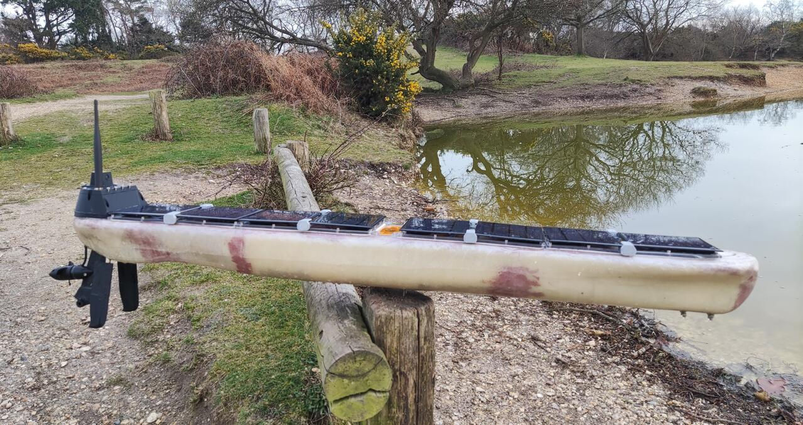
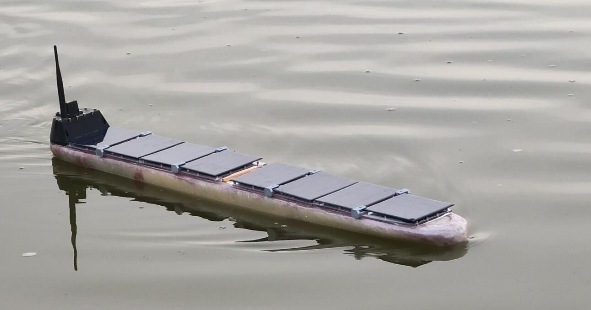
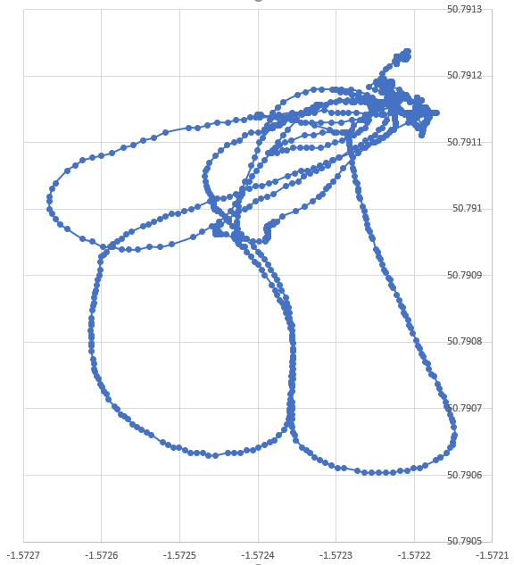
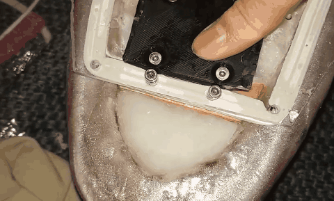
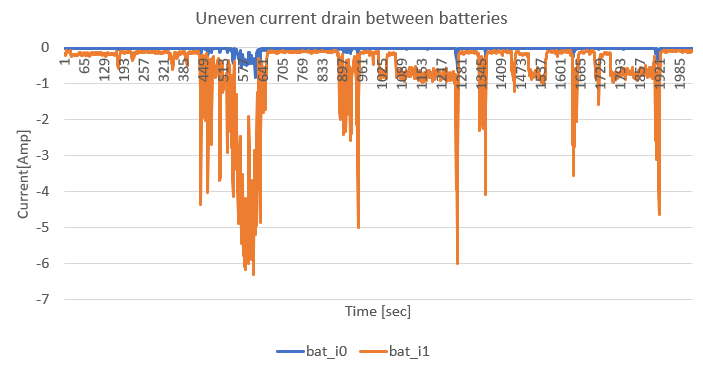

# Second motor powered experiment

After the first experiment, lots of issues were found. Fixing them took quite a lot of time but finally was all solved. .

So I decided to take another motor propelled experiment to test the rudder effectiveness and the waypoint mission. 

Overall, the experiment went well. 

- rudder effectiveness improved by increasing the angle limitation and extending the length. 

- There is still a problem with LORA communication. 

- There is only one water leaking issue found on the bow deck due to a unscrew bolt. 

- Waypoint planning seems effective, the boat can drive itself toward the waypoint and path direction. Although the turning radius is still quite large. 

- Camera exposure is now working correctly, however, there were some issues with the wire connection. All images taken during the experiment are broken, cannot be fixed. It's a pity. 

## Waypoint mission

Thanks to the navigation simulator, I was able to validate my navigation algorithms in the simulated world. See the [navigation development log](navigation.md) for details.

I use the default parameters for the waypoint mission, which is very rough and conservative. however, it did work well. The PID parameters were set to 1, 0, 0. which means every metre of  *cross track error* turns the rudder for 1 degree. No integration and damping components. The pond seems a little bit small for testing the waypoint function but the result is still exciting. 

While we solved the EMI issue, the GNSS can locate the boat pretty well now. 

With only 20% of throttle, the boat sails peacefully. 

## Unstable rolling motion

without hydro wings, keel and underwater ballast, the boat is still unstable at high throttle. 

I am not worrying too much about that because when the wing sail is ready, we must install the keel together with the ballast. 

## Minor water leaking

The gaps between the screw and polycarbonate glass are not sealed correctly. When water came up to the deck, it is leaking into the boat. I bought a bag of O ring for sealing the gap, hopefully can fixed this issue. 

The other water leaking source is the screws for the 3D printed solar panel mounts. The bot underneath became loose very easily when some water is leaking in. I would seal them with silicone glue for the future test.

## Batteries management issue

- One of the protectors is broken. Looks like the IC is bricked at charge protection. I could not recover from the error state. I replaced the protection board with a working one.

- The motor drain majority of current from one of the battery. Later found this was due to a short under the ideal diode controller.  Fixed. 

