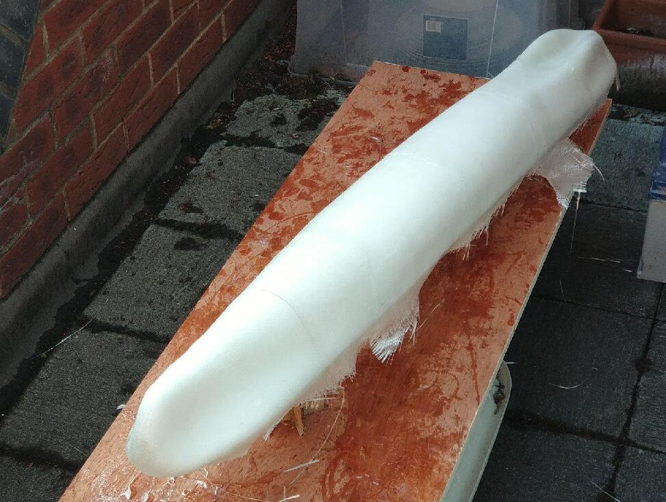

# Hull building

I have almost zero experience in designing neither building a boat hull. During the building, I made quite a few mistakes. But finally, something was built...

## Hull designing in Fusion 360

There are some points that need to take care of when designing the hull. 

- The hull should be as skinny as possible. To lower the drag, also allow my 3D printer to print the segment (<18cm diameter).  
- However, the deck area should be large enough to hold as many solar panels as possible.

A smaller boat requires fewer materials to build, which will always lower the cost. So I basically designed the deck that can host the minimum number of required solar panels. A single panel size 11 x 13cm, generate a peak power of 2W. Per the preliminary calculation, we will need at least 8 of them. 

Since the boat will sail at a lower speed (< 2knots), a small displacement hull is enough. Here is the design.

- Total buoyancy: ~15kg

- Displacement: ~8kg

- Length: 1140mm

- Width: 140mm

- Height: 90mm

The hull has almost the same 140mm width for 90% of the length. Allows the panels to lay on most of the deck evenly. The front of the hull underwater part is a typical displacement hull design. I didn't pursue a narrow tip which is normally used in high-speed hull or RC model sailing boats. Because we still need a large top for the panels and the boat is too small which will easily be submerged in the incoming wave.

Also, the large top also increases the buoyancy when submerged in a wave. This increase the instability in a normal boat hull, which is not a good choice. However, with wave propelled wings, the increased tip buoyancy will lead to more lift on the front underwater wings. Thus, it should provide more propulsion. The lift loaded on the wing stabilized the boat.

The tail design also follows a similar principle of steep buoyancy change, with the bottom of the hull (at the end) being raised near the waterline. When a wave comes, the buoyancy will increase very quickly to pull up the tail underwater wing.
At the tail, there was also a motor mount and the hull stick out for protecting the motor. But later found this is not a good design.

We will have 2 rudders (for backup). Rudders are offset to the side by 15 degrees. It was meant for better steering during sailing. When the wind hit the air wing, the lift of the air wing will not only generate propulsion but also a side force (actually, the side force will be larger than propulsion most of the time). The side force will cause the boat to roll quite much. The offset rudder will be more effective compared to the regular rudder.

## Hull building

After some search online, I decided to build the hull with epoxy and fibreglass. So I brought some 300gsm fibre chopped strands, 300 gsm cloth and 1kg epoxy.

I don't want to build a mould because it is too complex for me to do. I decided to print the hull using my 3D printer, then glue them together. Then apply a 3mm fibreglass-epoxy on the outside. Then sand down the surface to make it smooth.

The plan sounds ok but ends up with a lot of trouble!

- First, the fibreglass chopped strands and cloth are too rough for a small boat like this. They cannot easily band during the corners. I have to keep bending it during the final curing hours. But the result is still not perfect. It also result in quite a lot of bubbles after I remove the 3D printing part. It might result in leaking water!

- Second, the epoxy is refused to glue on my 3D-Printing materials (PLA+). The connection is not strong enough. PLA can be torn off into large pieces.

- Third, the surface is not perfectly smooth. Epoxy did a great job for self-smoothing but the cloth is too rough, making it impossible to sand down. I have to buy another roll of 100 gsm fibreglass cloth to do a final layer and a coating epoxy layer.

Fortunately, the structure are firm enough. I can even stand on the hull. The final coating also filled in the small bubbles. 

### 3D Printing

Printing the bow section

There is a big hold on the bow. It is expected and ok since we will cover it with epoxy and fibreglass. 

Fixed bow

Glued hull. The shape is already there. The quality is quite good. There is no twisting which I was quite worried about. This bench will also be my main working station for the rest of the building.

The next step is fibreglass the outside of the 3D printed hull. The first layer is chopped strands. 

Last layer use fibreglass cloth. It looks all right but the deck is already starting to tear off by gravity and the tension of the cloth.

After it was cured (and being exposed to the weather for a few months...), I then sand it down the first time, leaving quite a lot of hollowness. So I brought some "microballoons" as filler. But when I receive the package, I found it is dark colour which was not expected. I did use it once before on my RC glider, it should be bright white colour. Later I found out this microballoons is not glass balloons but some plastic.

Mixing the micrballoons with epoxy.

The colour was really not pleased, at least not my favour. 

When the filer is cured, I sand it down and apply another layer of 100gsm fibreglass cloth. 

Then I remove most of the 3D printing parts from the inside because they are too easy to be a breakdown, I couldn't rely on fixing parts on the 3D printed part but have to directly contact the epoxy part.

After the final layer, I sand them down and a final coating. It is quite smooth.

The fibre epoxy part is now finished. I then reinforce the wooden board for use as a deck.

They are then being glued inside of the hull, with direct contact to the epoxy for maximum strength. Below is the middle deck, which will also hold the mast so I use a wider board. I also cut some cross lines to enforce the contract. I did not add a layer of fibreglass here. Hopefully, it is strong enough. 

Another layer of epoxy coating for water-proofing. 

By now, the hull weight 1.7kg.

There still many works to do, such as foam filling, drilling and painting. They need to be done after electronics/actuators are installed. 

To be continue..
