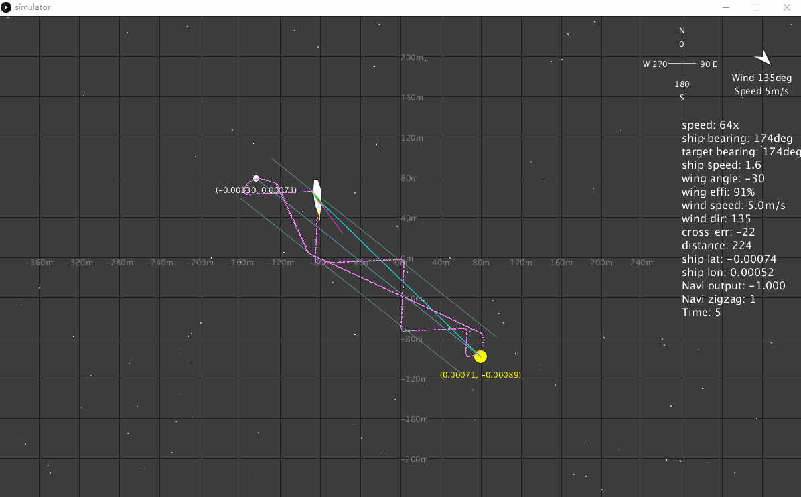

# Navigation

Navigation is a challenge for the small boat like DeepPlankter. 

- The ship might equip with a free-rotated wing. Head wind and tail wind will generate little-to-no force. The boat need to offset to the wind direction. 
- The propulsion (from wing or wave) is small and unstable. It can even be push back by wind or sea current. The navigation should be able to drive the boat back in this situation.   
- The boat cruising speed is very low.  

## Simulator

> The source code is available in [navi-sim](https://github.com/majianjia/nav-sim)

To ensure the navigation algorithm works as expected, I actually build a 2-D simulator out of [Processing 3](https://processing.org/). Processing 3 is basically a java graphical lib with some customized interfaces. This simulator is extremely helpful for me to develop a navigation. 

Up until today, it has the features below:

- Ture earth coordination
- Dynamic wind simulation [direction, wind guest, wind speed]
- Dynamic sea current [direction, speed]
- Drag
- Boat physical model
- Interactive waypoint 
- Time wrapping

Although most of them are very simple, it still can cover most extreme situation such as strong wind, guest wind and strong current.  

## Navigation strategy

Different drone navigations algorithm have been widely implemented on many open source flight controller. Actually, most of the opensource flight controller use the so called [L1 navigation algorithm (original paper)](http://redmine.roboime.com.br/attachments/download_inline/351/gnc_park_deyst_how%5B1%5D.pdf) or its variances. It is robust and already been validated by a lot of experienced users. 

The most significant principle for L1 is it uses the term of "the acceleration back to track" (a_s_cmd) as the key parameter to control the course correction. Also, in many L1 implementations, they assume that η is a very small number so sine can be replaced by linear functions. L1 give drones very good track following method no mater the track is a line or a curve. It is also very simple to tune because there is only one parameter call L1, which define many things. Such as the track width, the damper for the stay on track acceleration, the length of line-of-sign to track, and others.  Here is the L1 principle (figure copyright belong to the paper author). 

The question for me is whether I should implement L1 or develop a specific algorithm for the boat. There are some considerations:

- Compared to air drone or rover, the boat I built is aim to low speed ( < 2knot) but also at a very large scale waypoints (10-100km). The "stay in track" capability is not very helpful since the track can be very wide(100m or ~km). 

- The navigation should also implement the zigzagging when the boat is heading into the wind direction or away from wind direction. Otherwise, the air wing give us little to no propulsion or even drag.  

- The boat will also likely to be in extreme situation such as strong wind and current in a storm. It is not clear whether the L1 can handle that. (not sure my algorithm can neither)

- L1 use only one parameter to define many terms that used in the algorithm. This is not very feasible for this boat navigation situation.

To sum up, using L1 here will not be ideal, since we are not taking advantage of following track or the simplify parameter setting. Instead, we still need to have finer turning parameters such as track width and others. 

## Track following

Track following is still needed, as the distance between waypoint can be too long. But will not try too hard to get back to the track. For the track following, unlike L1, I use a P controller on the crosstrack distance to get the course correction back to track. This correction is also limited by a fixed threshold, call max_offset_angle, this is normally in range of 45 deg to 70 deg.

This is a very simple P controller, but the P setting will be very low so I am not too worry about oscillation. In the actuation implementation, there are also heavy filtering and lazy responding implementation. Small correction will not trigger the servo action (servo will be power down most of the time to save power). 

## Out of track detection and secondary track

Out of track detection calculate the track distance to the primary track. If the distance is larger than n=3 times of path width. The boat will no longer sail follows the track to the primary target. Instead, it create a secondary target waypoint on the primary track. Then it start to follow the secondary track in order to get back into the primary track. 

The insertion point between secondary track and primary track is defined by the boat's current location and the maxi_offset_angle.

 
