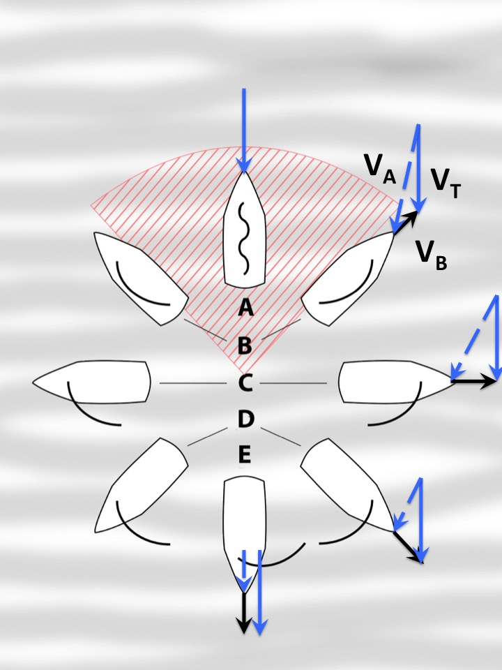
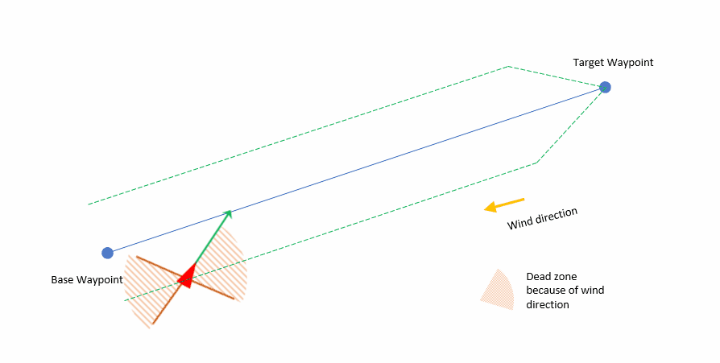
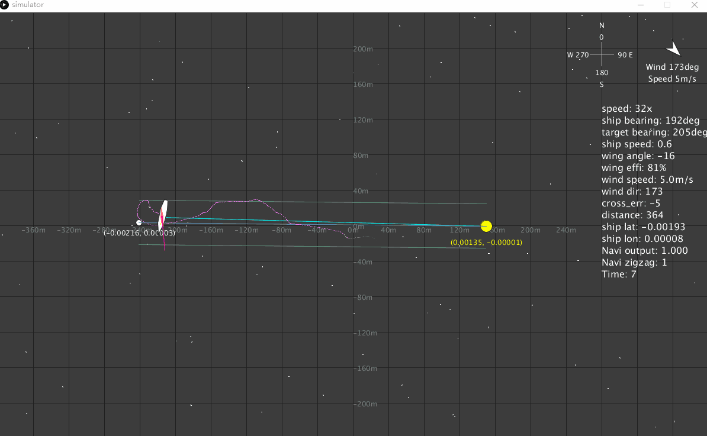

# Navigation

Navigation is a challenge for a small boat like
DeepPlankter.

- The ship might equip with a free-rotated wing. Headwind and tailwind will generate little-to-no force. The boat needs to offset to the wind direction.
- The propulsion (from wing or wave) is small and unstable. It can even be pushed back by wind or sea current. The navigation should be able to drive the boat back in this situation.  
- The boat cruising speed is very low.  

## Simulator

> The source code is available in the dedicated [navi-sim repo](https://github.com/majianjia/nav-sim)

To ensure the navigation algorithm works as expected, I actually build a 2-D simulator out of [Processing 3](https://processing.org/). Processing 3 is basically a java graphical lib with some customized interfaces. This simulator is extremely helpful for me to develop a navigation algorithm. 

Up until today, it has the features below:

- Ture earth coordination
- Dynamic wind simulation [direction, wind guest, wind speed]
- Dynamic sea current [direction, speed]
- Drag
- Boat physical model
- Interactive waypoint 
- Time wrapping

Although most of them are very simple, they still can cover the most extreme situations such as strong wind, guest wind and strong current.  

## Navigation strategy

Different drone navigations algorithm have been widely implemented on many open source flight controllers. Actually, most of the opensource flight controllers use the so-called [L1 navigation algorithm (original paper)](http://redmine.roboime.com.br/attachments/download_inline/351/gnc_park_deyst_how%5B1%5D.pdf) or its variances. It is robust and has already been validated by a lot of experienced users.

The most significant principle for L1 is it uses the term "the acceleration back to track" (a_s_cmd) as the key parameter to control the course correction. Also, in many L1 implementations, they assume that η is a very small number so sine can be replaced by linear functions. L1 give drones a very good track following method no matter the track is a line or a curve. It is also very simple to tune because there is only one parameter called L1, which define many things. Such as the track width, the damper for the stay on track acceleration, the length of line-of-sign to track, and others. Here is the L1 principle (figure copyright belong to the paper author).

The question for me is whether I should implement L1 or develop a specific algorithm for the boat. There are some considerations:

- Compared to air drones or rovers, the boat I built is aimed to low speed ( < 2knots) but also at very large scale waypoints (10-100km). The "stay in track" capability is not very helpful since the track can be very wide(100m or ~km). 

- The navigation should also implement the zigzagging algorithm when the boat is heading into the wind direction or away from the wind direction. Otherwise, the air wing give us little to no propulsion or even drag.  

- The boat will also likely be in extreme situations such as strong wind and current in a storm. It is not clear whether the L1 can handle that. (not sure my algorithm can either)

- L1 use only one parameter to define many terms that are used in the algorithm. This is not very feasible for this boat navigation situation.

To sum up, using L1 here will not be ideal, since we are not taking advantage of the following track or the simplified parameter setting. Instead, we still need to have finer tuning parameters such as track width and others. 

We are more interested in large scale direction, for example, the path width can be 100 metres or ~km when in the ocean. Compared to these distances, the boat speed or accelerations seem very small. It is unnecessary to wake up the actuators to do a small correction. We only care about whether the boat is heading toward the right direction in a long time scale (minutes or hours.)   

## Track following

However, track following is still needed, as the distance between the waypoints can be too long, simply heading to the target waypoint will have very limited resistance to interference such as wind and current. What we don't want is not try too hard to get back to the track, which consumes our limited battery power. For the track following, unlike L1, I use a P controller on the cross track distance to get the course correction back to track. This correction is also limited by a fixed threshold, called max_offset_angle, this is normally in range of 45 deg to 70 deg.

This is a very simple P controller, but the P setting will be very low so I am not too worried about oscillation. In the actuator output implementation, there are also heavy filtering and lazy responding implementation, so a small correction will not trigger the servo action (servo will be power down most of the time to save power). 

## Out of track detection and secondary track

Out of track detection calculate the track distance to the primary track. If the distance is larger than n=3 times of track width. The boat will no longer sail follows the track to the primary target. Instead, it creates a secondary target waypoint on the primary track. Then it starts to follow the secondary track to get back into the primary track. 

This seems unnecessary because the track following always drive the boat back to track. However, it is very useful for wing sailing which we will discuss in the next section.  

The insertion point (the secondary target) between the secondary track and the primary track is defined by the boat's current location and the max_off_angle, the angle is set to < 90deg. At least, it will not go backward.

Simulation :

To be noticed that we use heading instead of course for this calculation for simplicity. It is expected strong current will push the  boat out of track quite often. But as I mention, we are not aiming for an extreme track following. 

Also, the parameters we use do not contain derivative components (speed or acceleration), but we assume they are very small values compared to the waypoints and distance which hopefully make the parameters tuning cover most of the case. So, we don't need to do filtering because derivatives can be very noisy. 

## Navigation with air-wing

We know that sailboat cannot sail directly into the wind, there is an angle threshold where the wind propulsion drop dramatically, when the wind direction changes from side to the headwind. Sailors call this no-sail zone. 

For free-rotate wing sail, there will be another zone for tailwind. 

Many researches have been done with wing sailing, such as [Design of a free-rotating wing sail for an autonomous sailboat by CLAES TRETOW](https://www.diva-portal.org/smash/get/diva2:1145351/FULLTEXT01.pdf).  Below is the polar diagram from the thesis. 

This graph represents the wind direction (relative) vs boat speed. It is symmetric for the left and right sides. Here we only discuss the wind from the right. We can see that the boat start to struggle when the wind direction is over 150 deg (tail wind) or less than 30 deg (headwind).

I assume our boat has a similar diagram, so our navigation has to be able to void sailing into these "no-sail" zone. When the course to the target waypoint is close to the wind direction, we need to sail in a zigzag pattern to approach while avoiding sailing into the zone.

I considered the below ways to implement the zigzag path.

- Add temporary waypoints to form zigzag path + strict track following (such as L1). 

- Allow some free sailing zone within a large track. 

For the first method, adding temporary waypoints requires extra calculation and waypoint management. Also, it is not responsive when the wind direction changes during the temporary path. When generating a temporary waypoint, require stable wind direction measurement. This method requires many measurements which will increase the complexity.

For the second method, as I mentioned in the above sections, our navigation method has a large track width. So as long as the boat is on the track, it is free for the zigzag method to decide where to head. The zigzag method can decide the heading freely according to the current wind direction and wing angle. This method decoupled the zigzag algorism with navigation algorism. which make it easier to design.

The below diagram shows the second method. When the boat is within the track, it can sail freely in any direction, and of course, the zigzag algorism will navi the boat following the edge of the "no-sail" zone. When the boat finally reaches the boundary of the track, the track following algorism will override the zigzag output and turn the boat back into the track immediately.

There is a path shrinking angle that will shrink the path near the waypoint. This angle is normally set to arctan(2). 

In this zigzag mode, the "no-sail" zone is dynamically updated, depending on the wind angle measurement (which is relatively reliable). It is very good because the "wind direction" that we use is the relative direction, which combines the boat motion and the real wind motion. So it can continually update the heading to archive good wing efficiency.

## Zigzag algorithm

The zigzag algorithm is very simple. When inside the track, the zone is free for zigzag to decide where to head.

We first use the current wing angle to see if it is in the no sail zone. Then compare it to the course to target waypoint. If we will turn into the no sail zone, then we cancel the angle out so the boat follows the edge of the zone instead. It will continue to sail this until it reaches the other side track border, where it will reconsider which zone edge to follow.

## Code implementation

Please refer to the [firmware repo](https://github.com/majianjia/DeepPlankter-firmware) or the [simulator repo](https://github.com/majianjia/nav-sim) for the implementation. 

## Simulation in extreme situation

Finally this is the simulation in frequent changed wind direction. 

- added 20deg P-P wind direction noise (every cycle)

See the top-right corner arrow which indicates the average wind direction (the actual change of wind direction is much quicker). See also the "wing effi" statistics on the right-hand list, which records the percentage of time that when the wing is outside of "no-sail" zone (means the wings is effectively providing propulsion). The route that boat is changing very frequently to allow the wing in high-efficiency angles. Sometimes it even sails the boat backward.

Overall, this navigation method can drive the boat to the destination even in an extreme scenario.

You can run the simulator yourself by downloading the code from the  [simulator repo](https://github.com/majianjia/nav-sim). The environment can be changed through the source code.
