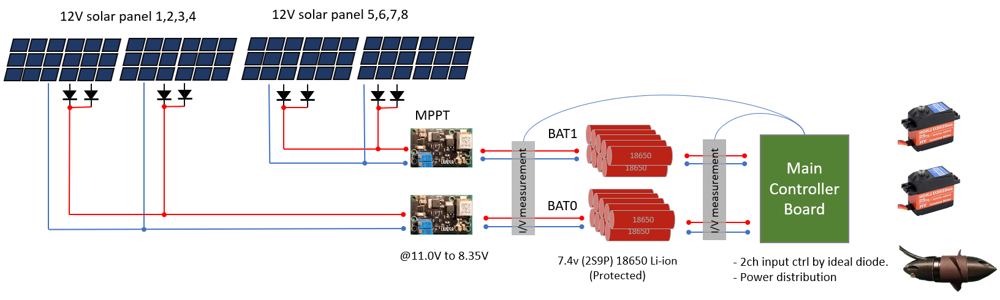
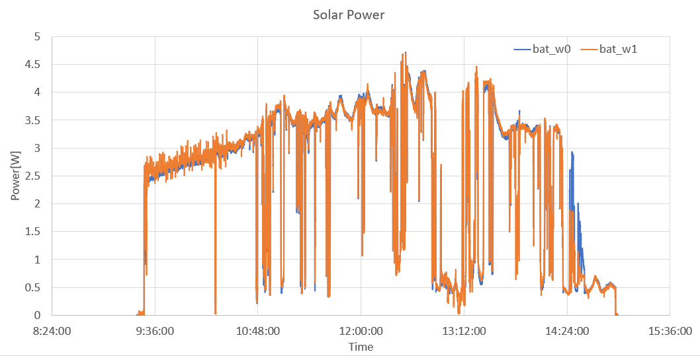
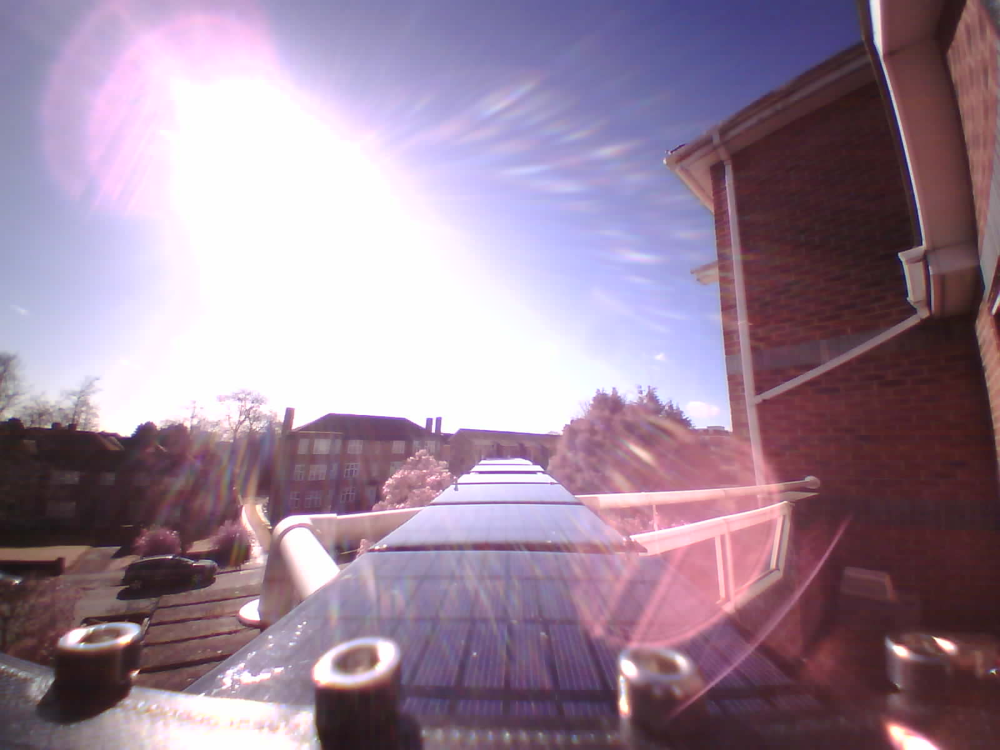

# Power plan

The the power all power plan on the boat is shown below.

This is a simplified diagram that doesn't include power switches, battery protection circuits, temperature sensing and some other current sensing. 

## Solar panels

Our panels are laid flat on the deck so the sun angle is very important for the test because the angle of light affect the effective area on the panels. 

The panel has rated 12V at 160mA under 1000W/m^2 (this number is about the direct sunlight on the ground). According to my previous measurement, each panel measured open-circuit voltage at 13.7V and short-circuit current at ~150mA. 

A solar panel power test was done on 17 March.

On 17 March 2022, the maximum sun angle is 40 degrees in Southampton UK. If we only consider the power is produced by the direct sunlight but not scattering light (discuss later), the panels generate 76% power of its right angle sunlight theoretically.

As you can see from the power plan diagram, we have 2 sets of panels, 4 panels per set. Each rated 1.8 W according to their official data. So the maximum output for use should be 1.8 x 76% = 1.35W. Below is the measured power from the 2 sets of panels. 

There is some noticeable information from the graph. 

- Both sets of panels generate very similar output.

- At peak sun degree (12 o'clock, 40 deg height), each set of panel generate 4W power, (1W per panel), this number is lower than our calculation of 1.35 W. There are multiple reasons for it, 1) the series connected Schottky diodes consume power. 2) the MPPT voltage is set lower than the optimal voltage (discuss later.) 

- The peak power isn't the clear sky. If you see from 9:30 to 10:30 when the sky is crystal clear, the power output is steadily increased, but starts around 10:48, a higher peak power is received but together with some drops. The drops were due to cloud shade. The increased peak power is because the cloud is scattering sunlight which leads to more energy radiating on the panels. This is only my thought to explain this counterintuitive phenomenon. Whether the at a certain density of cloud will generate more energy than clear sky, I don't know. 

- In total, during the 5 hours experiment, the 2 sets of panels generate 24Wh energy, if we expend the time before 9:00 and after 15:00, I estimate it can generate 36Wh. I think this result is very promising. One of these partially cloudy days allows the boat to work 2 to 3 days. I am sure the boat can sustain most of the year and bad weather. 

What this number also means is that the sunlight can drive the boat in the daytime infinitely with 20% of the thruster throttle. In the second motor-driven test, at 20% throttle, the motor takes around 6W power while it can push the boat at a speed of 1.5 knots.   

Below photo was took at 10:26. 

## MPPT voltage and charge voltage

The MPPT module has 4A maximum current but apparently we won't use that much. The nominal voltage for the solar panel is 12V (24 small cells in series), but because we are using parallel connections, a Schottky diode is needed for each panels, in case of uneven lighting causing too much reverse current (turning the shaded panel into LED). Because the voltage drop of the diode, the MPPT point should be set lower. Per the datasheet of the diode I used, the voltage drop at 100mA is around 0.4V. So the MPPT point should be tuned at 11.6V. 

However, if you see the graph carefully, you will notice that the MPPT
voltage is in fact set to 11V which is lower than our calculation above. My
consideration is

- When the lighting is low, the solar panel's MPPT voltage is also reduced. If we still use the higher voltage, we will get very little power out. This is very important because we want the panel to produce power in bad weather more than on sunny days. A lower MPPT voltage decreases the power output on sunny day a bit but will ensure the panels work in darker lighting conditions.

- Besides lighting, a lower voltage can ensure all panels has space to generate current when they are not exactly the same. For example, some of them might be degraded differently during a time or they came with manufacturing defects. Result in cannot reach the higher MPPT voltage.

- Since we have a fixed MPPT voltage setting, a lower voltage will ensure us a larger safety margin.

To be continued.. 
