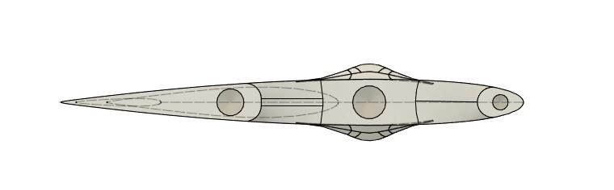
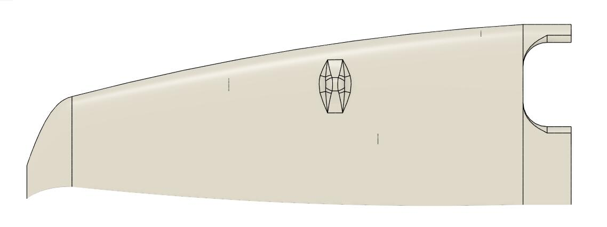
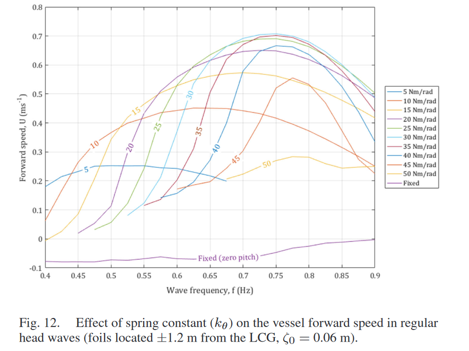
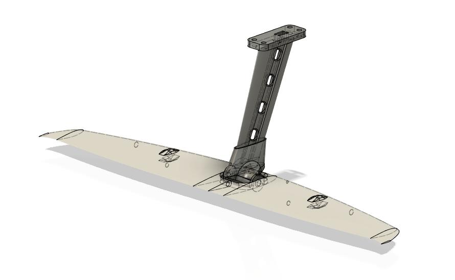
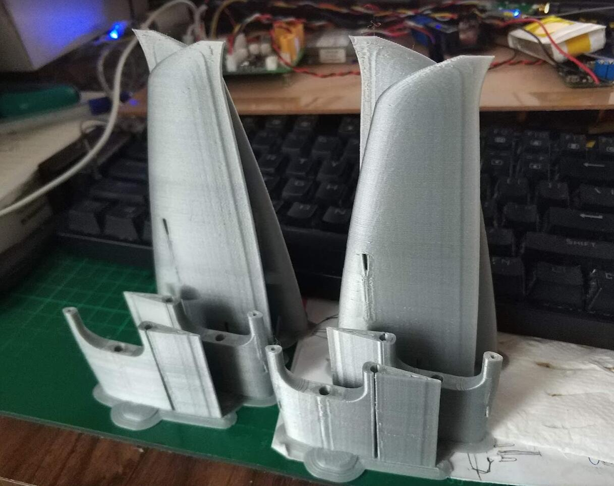
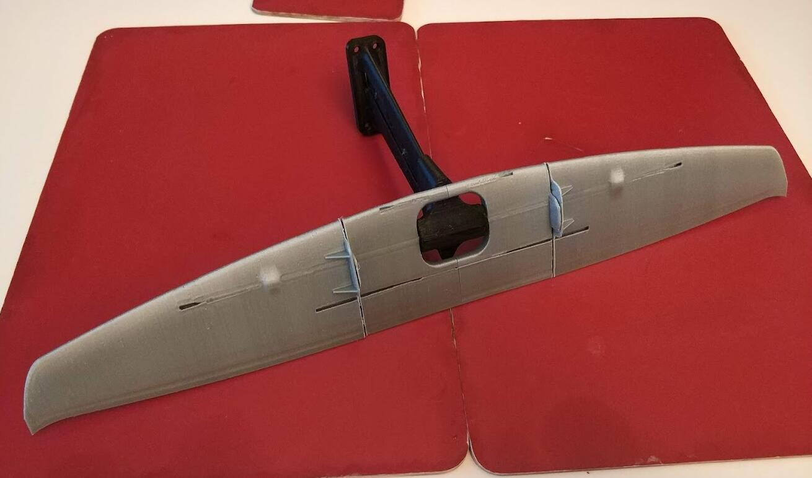
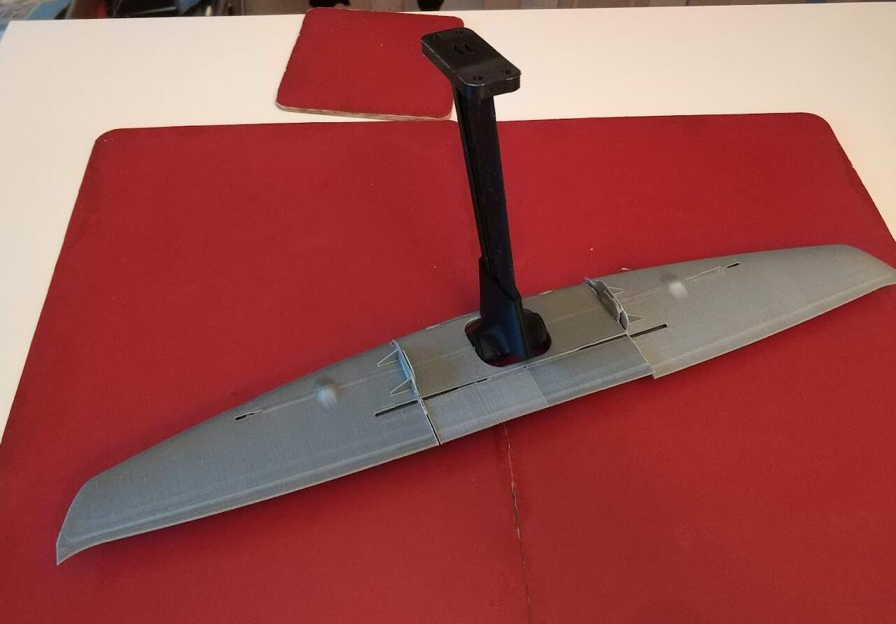
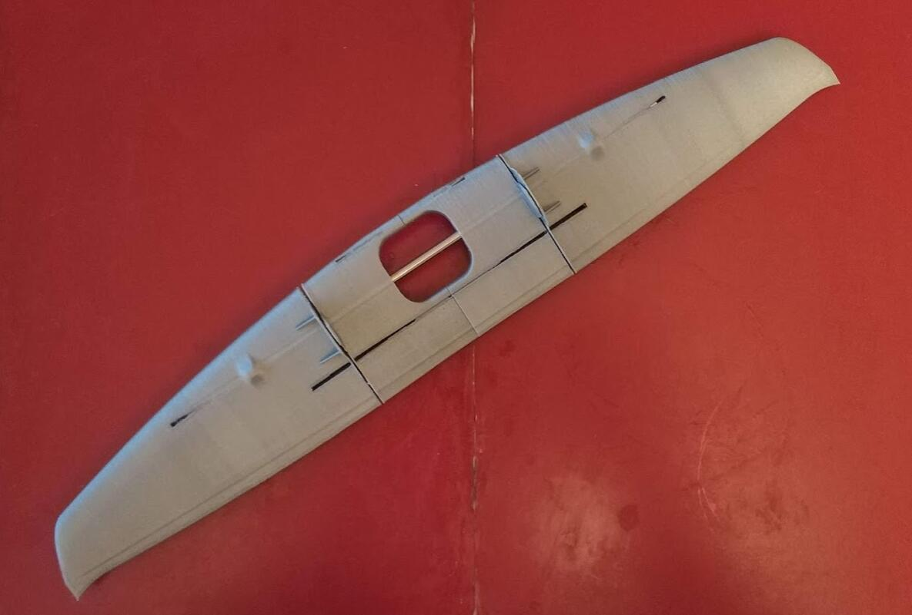
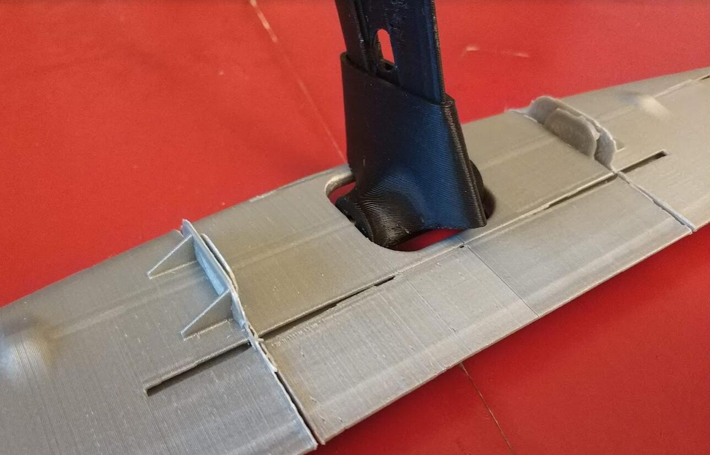

# Underwater Wings

The underwater wings are to convert the vertical motion (wave) of the hull to small forward propulsion. So the boat can sail forward without the need for energy.

I was planned to build the wing core from wood pieces. Cut the shape, then sand it down to streamline. But later I decided to let the 3d printer build the core. There are some issues with 3d printed parts.

- The PLA materials that 3d printer used might degrade in salt water ( which is not, later confirmed by research paper. )

- PLA can crack easily. 

- If we reinforce with glassfibre and epoxy, the epoxy has difficulty to glue on epoxy. 

To solve the second problem, we use a tough PLA to print the main part. For the third problem, I planned to use rough sand paper to sand it down and leave more scratches for the epoxy to grab on. 

I didn't use a standard airfoil on the underwater wing but built from my own experience from RC planes. The airfoil is symmetric so it should perform the same for both upward and downward directions.  It also has a small wing tip to lower the drag from induced drag (not sure whether this is useful but looks cool. )

Underwater wings are normally spring-loaded so the wing can work efficiently during different vertical motions.  [This paper by University of Southampton](https://eprints.soton.ac.uk/442253/1/Forward_Speed_Prediction_of_a_Free_Running_Wave_Propelled_Boat.pdf) has thoroughly investigated the speed and different underwater setup. 

Although, high springs loaded wing will produce faster speed when the wave frequency match the wing design. Load springs load has a much wider working range. However, the above data are from their testing design, in which wing has a larger chord (see the original paper for details).  

I don't plan to use springs on the wings. It is hard to match springs. Also, I don't think it is necessary since our wing has a short chord, so it should turn to its maximum positive or negative angel very quickly where propulsion is generated. 

If this doesn't work well, I will consider adding springs. 

Today, the wings core are printed. 

A 4 mm stainless steel axis is used. All weight and lift are loaded on the axis. This is where the wing will rotate on. This location is at the ahead of the lift centre, so the wing  will lead to the vertical movement and covert the lift to the forward force. 

The next step is to glassfibre this wing and the supported mount. 

To be continued. 

